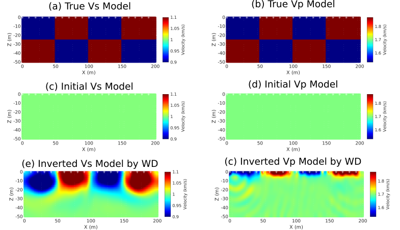

2D Wave-equation Dispersion Inversion Lab (2DWD)
=================================================

 

 Introduction
 ------------

2D wave-equation dispersion inversion of surface waves (WD) is implemented by using [SeisFlows](https://github.com/rmodrak/seisflows)+[SPECFEM 2D](https://github.com/geodynamics/specfem2d).

This is the updated version of SeisFlows for 2D wave-equation dispersion inversion of surface waves

I provide "dispersion.py" in "seisflows/preprocess/" which is to calculated the FK spectrum and misfit function and create the adjoint source for 2D WD.

Prerequisite
------------
- [SPECFEM2D](https://github.com/geodynamics/specfem2d)
- [Seisflow]
- Python 2.7

Installation
------------
1. Follow this [instruction](https://seisflows.readthedocs.io/en/latest/instructions_remote.html) to install Seisflow-2DWD.
2. install [SPECFEM2D](https://github.com/geodynamics/specfem2d)
3. Set up checkerboard test in `EXAMPLE/checker_2dwd`
    - Make sure that all paths specified in paths.py are correct.
    - Run checkerboard test:``sfclean;sfsubmit``

References
----------

If find this package useful, please cite:

`Zhaolun Liu, Lianjie Huang, (2019), "Multiscale and layer-stripping wave-equation dispersion inversion of Rayleigh waves", Geophysical Journal International 218(3):1807-1821, https://doi.org/10.1093/gji/ggz215`

`Zhaolun Liu, Jing Li, Sherif M. Hanafy, Kai Lu, and Gerard Schuster, (2020),"3D wave-equation dispersion inversion of surface waves recorded on irregular topography", GEOPHYSICS 85: R147-R161, https://doi.org/10.1190/geo2019-0537.1`

`Jing Li, Zongcai Feng, Gerard Schuster, (2017), "Wave-equation dispersion inversion",  208(3):1567-1578, https://doi.org/10.1093/gji/ggw465`

Also for SeisFlows, please cite Ryan Modrak's paper:

`Ryan Modrak, Dmitry Borisov, Matthieu Lefebvre, Jeroen Tromp; SeisFlows?Flexible waveform inversion software, Computers & Geosciences, Volume 115, June 2018, Pages 88-95, https://doi.org/10.1016/j.cageo.2018.02.004`

`Ryan Modrak, Jeroen Tromp; Seismic waveform inversion best practices: regional, global and exploration test cases, Geophysical Journal International, Volume 206, Issue 3, 1 September 2016, Pages 1864–1889, https://doi.org/10.1093/gji/ggw202`
