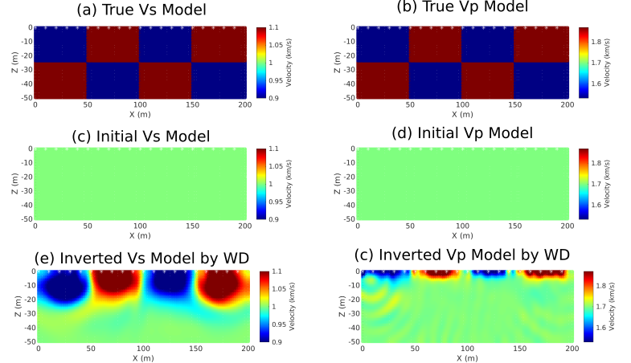

.. SeisFlow-2DWD documentation master file, created by
   sphinx-quickstart on Mon Aug 23 16:20:58 2021.
   You can adapt this file completely to your liking, but it should at least
   contain the root `toctree` directive.

2D Wave-equation dispersion inversion lab
=========================================

Introduction
------------
The most sophisticated waveform inversion packages are proprietary codes developed by oil and gas companies and geophysical service providers.  Usually, such packages are maintained by software engineering teams and not available to independent researchers.

Outside of industry, a number of open source waveform inversion packages have been developed, mainly in geophysics but also in nondestructive testing and other areas. Many early waveform inversion packages used simple frequency-domain formulations, which were well-suited for research but not readily scalable.  

More recent packages such as SeisFlows use Python for data processing tasks in combination with parallel compiled code for wave simulation.  This approach combines the ease of use of modern scientific Python and with the efficiency and scalability of modern acoustic and elastic time-domain solvers.

With SeisFlows, wave simulations must be performed using an external software package such as SPECFEM2D or SPECFEM3D. The ability to interface with external solvers provides flexibility, and the choice of SPECFEM as a default option gives access to cutting-edge solver capabilities. However, the need for an external package imposes some additional demands on the user as described `here <http://seisflows.readthedocs.io/en/latest/instructions_remote.html#creating-your-own-examples>`_.

SeisFlows provides an automated nonlinear optimization workflow, with the option to carry out multiple model upates without stopping or to stop between updates for quality control checks.

   *Inverted S-wave speed model with maximum offset of 24 m (No precondition)*

Prerequisite
------------
thest

Procedure
------------
the~

.. toctree::
   :maxdepth: 2
   :caption: Contents:

Indices and tables
==================

* :ref:`genindex`
* :ref:`modindex`
* :ref:`search`
